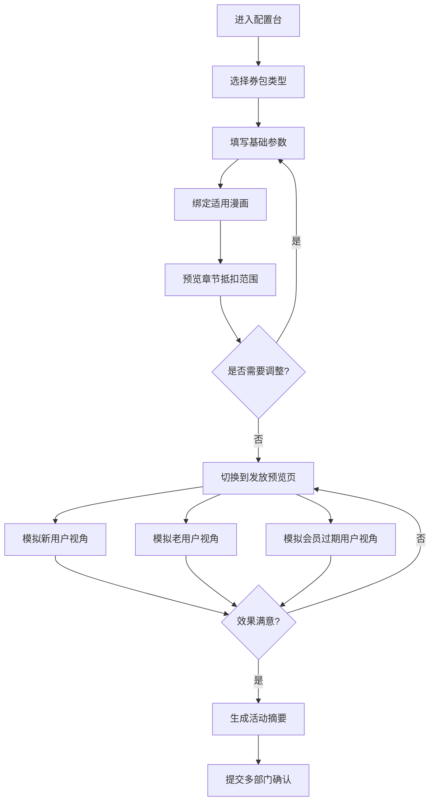

## 1. 产品概述

本产品是面向漫画平台运营专员的 Web 券包配置台，用于将正版漫画券从"临时发券"转变为可复用的活动配置工具。通过标准化的券包配置流程，提升运营效率，降低发券错误率，确保活动规则统一。

- 核心目标：提供可视化、流程化的券包配置体验，支持多类型券包创建、作品精确绑定、发放效果预览及活动摘要自动生成
- 目标用户：漫画平台运营专员、主编、商务、客服团队
- 市场价值：将运营动作产品化，实现活动快速上线、规则透明、多部门协同确认

## 2. 核心功能

### 2.1 用户角色

| 角色 | 访问方式 | 核心权限 |
|------|----------|----------|
| 运营专员 | 内部系统登录 | 券包新建、编辑、配置、预览、生成活动摘要 |
| 主编/商务 | 内部系统登录 | 查看配置、预览效果、审批活动摘要 |
| 客服 | 内部系统登录 | 查看活动摘要、复制话术模板 |

### 2.2 功能模块

1. **券包配置页**：券包类型选择、基础参数配置、作品绑定、章节范围预览
2. **发放预览页**：多用户角色模拟、领取入口预览、券包说明展示、使用提示
3. **活动摘要页**：预计覆盖书单、领取规则、客服话术一键复制

### 2.3 页面详情

| 页面名称 | 模块名称 | 功能描述 |
|----------|----------|----------|
| 券包配置页 | 券包类型选择 | 提供三种预设类型：新用户追更包、完结篇补券包、会员回流包，以卡片形式展示，点击选中 |
| 券包配置页 | 基础参数配置 | 填写券张数、有效期、是否限制单本使用，提供实时校验 |
| 券包配置页 | 作品绑定 | 搜索并选择适用漫画，支持多选，展示已选漫画列表 |
| 券包配置页 | 章节范围预览 | 以简单列表展示每张券能抵扣的章节范围，高亮标识付费番外避免误选 |
| 发放预览页 | 用户角色切换 | 支持切换新用户、老用户、会员过期用户三种视角 |
| 发放预览页 | 领取入口模拟 | 展示不同用户看到的领取按钮样式、位置、文案 |
| 发放预览页 | 券包说明展示 | 展示券包详情弹窗，包含使用规则、有效期、适用范围 |
| 发放预览页 | 使用提示 | 模拟用户领取后的使用引导提示 |
| 活动摘要页 | 覆盖书单 | 自动生成预计覆盖的漫画书单，包含书名、作者、章节范围 |
| 活动摘要页 | 领取规则 | 汇总所有领取条件和使用限制 |
| 活动摘要页 | 客服话术 | 生成可复制的客服话术模板，支持一键复制 |

## 3. 核心流程

运营专员进入配置台后，首先选择券包类型，然后填写基础参数（券张数、有效期、使用限制），接着绑定适用漫画作品并预览章节抵扣范围，确认无误后切换到预览页面模拟不同用户角色的看到的效果，最后生成活动摘要提交审批。

## 4. 用户界面设计

### 4.1 设计风格

**设计理念**：采用"编辑室/工作台"风格，营造专业、高效的运营工具氛围。主色调采用深蓝墨水色搭配暖橙点缀色，象征印刷与创作的结合，突出漫画内容平台的文化属性。

- **主色调**：深海蓝 #1a2332（沉稳专业），搭配午夜蓝 #0f1623（背景）
- **点缀色**：暖橙色 #ff7a45（强调按钮、选中状态），暖黄 #ffc53d（警示提示，如付费番外标识）
- **成功色**：薄荷绿 #52c41a（配置有效、可提交）
- **字体**：标题使用 "Noto Serif SC"（宋体风格，文艺感），正文使用 "PingFang SC"（清晰易读）
- **按钮风格**：直角轻微圆角（2px），强调按压感，选中状态有内阴影
- **布局风格**：三栏式工作台布局，左侧导航、中间主配置区、右侧实时预览面板
- **图标风格**：线性图标搭配手绘风格装饰元素，融入漫画气泡、分镜框元素

### 4.2 页面设计概述

| 页面名称 | 模块名称 | UI 元素 |
|----------|----------|---------|
| 券包配置页 | 券包类型选择 | 三张特色卡片，各自有独特的插画风格背景（新用户：火箭/成长、完结篇：奖杯/完成、会员回流：心形/回归），卡片hover有上浮动画，选中有橙色边框高亮 |
| 券包配置页 | 基础参数配置 | 表单采用左标签右输入布局，数字输入框带步进器，日期选择器带日历弹窗，开关控件带状态文字 |
| 券包配置页 | 作品绑定 | 搜索框带自动补全下拉列表，已选作品以标签形式展示，可删除，右侧面板展示章节范围列表 |
| 券包配置页 | 章节范围预览 | 列表以"券N - 第X章 ~ 第Y章"形式展示，付费番外章节用黄色背景和感叹号图标醒目标识 |
| 发放预览页 | 用户角色切换 | 顶部 Tab 切换，每个 Tab 带用户头像图标，切换有淡入过渡动画 |
| 发放预览页 | 领取入口模拟 | 手机模拟外框展示，内部还原 APP 界面，领取按钮有脉冲动画 |
| 发放预览页 | 券包说明展示 | 弹窗模拟，带毛玻璃背景，内容区域有分镜线条装饰 |
| 活动摘要页 | 覆盖书单 | 表格展示，支持导出，行hover高亮 |
| 活动摘要页 | 客服话术 | 卡片式布局，每个话术块右上角有复制按钮，点击有成功提示 |

### 4.3 响应式设计

- 采用桌面端优先设计（1440px 基准）
- 三栏布局在 1024px 以下自动调整为两栏（导航收起、配置区+预览区）
- 768px 以下切换为单栏流式布局，使用折叠面板分组展示
- 所有表单控件支持键盘操作，焦点状态有明确视觉反馈

### 4.4 动效设计

- 页面加载：顶部进度条 + 内容区淡入上移（stagger 动画）
- 卡片选择：缩放 1.02 + 边框颜色过渡 + 阴影加深
- 章节列表：展开/收起时高度平滑过渡
- 预览切换：横向滑动过渡（模拟页面切换）
- 复制成功：按钮变为对勾图标 + 轻微弹跳动画
