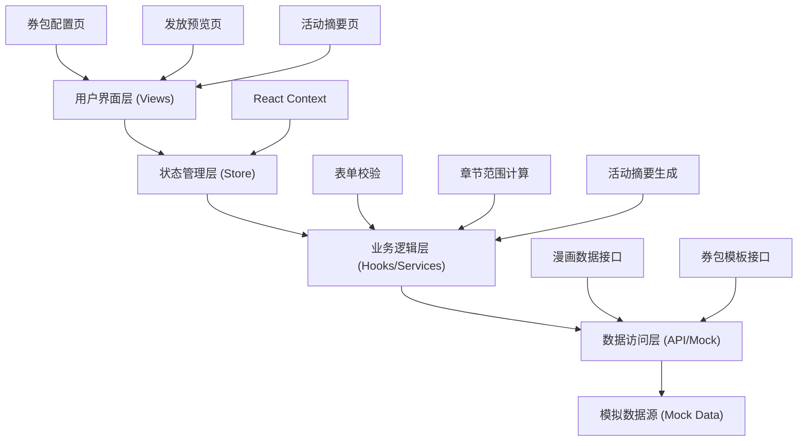
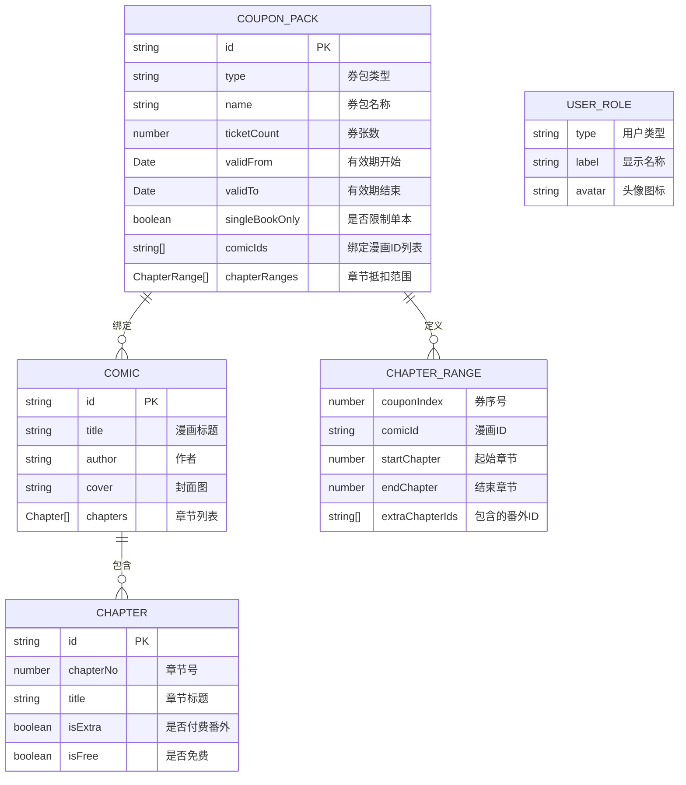

## 1. 架构设计

本项目为纯前端单页应用（SPA），采用分层架构设计，通过状态管理实现数据共享，使用 Mock 数据模拟后端接口。



## 2. 技术描述

- **前端框架**：React@18 + TypeScript@5
- **构建工具**：Vite@5
- **样式方案**：TailwindCSS@3 + CSS Variables
- **状态管理**：React Context + useReducer
- **路由管理**：React Router DOM@6
- **图标库**：Lucide React（线性图标，符合设计风格）
- **日期处理**：date-fns
- **Mock 数据**：内置 TypeScript 类型定义的模拟数据
- **代码规范**：ESLint + Prettier

## 3. 目录结构

```
src/
├── components/          # 通用组件
│   ├── layout/         # 布局组件（侧边栏、顶部导航）
│   ├── form/           # 表单组件（输入框、开关、日期选择器）
│   └── ui/             # UI 基类组件（卡片、按钮、标签）
├── pages/              # 页面组件
│   ├── CouponConfig/   # 券包配置页
│   ├── Preview/        # 发放预览页
│   └── Summary/        # 活动摘要页
├── store/              # 状态管理
│   └── CouponContext   # 券包配置全局状态
├── hooks/              # 自定义 Hooks
│   ├── useFormValidation.ts
│   ├── useChapterRange.ts
│   └── useMockData.ts
├── types/              # TypeScript 类型定义
│   └── index.ts
├── mock/               # Mock 数据
│   ├── comics.ts
│   └── couponTemplates.ts
├── utils/              # 工具函数
│   ├── formatters.ts
│   └── validators.ts
├── styles/             # 全局样式
│   └── variables.css
├── App.tsx
├── main.tsx
└── router.tsx
```

## 4. 路由定义

| 路由路径 | 页面名称 | 功能描述 |
|----------|----------|----------|
| `/` | 重定向到 `/config` | 默认跳转配置页 |
| `/config` | 券包配置页 | 券包类型选择、参数配置、作品绑定、章节预览 |
| `/preview` | 发放预览页 | 多用户角色模拟、领取入口预览、使用提示 |
| `/summary` | 活动摘要页 | 覆盖书单、领取规则、客服话术 |

## 5. 数据模型

### 5.1 核心数据结构



### 5.2 TypeScript 类型定义

```typescript
// 券包类型
export type CouponPackType = 'new_user' | 'completed' | 'member_return';

// 用户角色类型
export type UserRoleType = 'new_user' | 'existing_user' | 'expired_member';

// 章节信息
export interface Chapter {
  id: string;
  chapterNo: number;
  title: string;
  isExtra: boolean;
  isFree: boolean;
}

// 漫画信息
export interface Comic {
  id: string;
  title: string;
  author: string;
  cover: string;
  description: string;
  totalChapters: number;
  chapters: Chapter[];
}

// 章节抵扣范围
export interface ChapterRange {
  couponIndex: number;
  comicId: string;
  startChapter: number;
  endChapter: number;
  extraChapterIds: string[];
}

// 券包配置
export interface CouponPackConfig {
  id: string;
  type: CouponPackType | null;
  name: string;
  ticketCount: number;
  validFrom: string;
  validTo: string;
  singleBookOnly: boolean;
  selectedComicIds: string[];
  chapterRanges: ChapterRange[];
}

// 活动摘要
export interface ActivitySummary {
  comicList: {
    comic: Comic;
    chapterCount: number;
    range: string;
  }[];
  rules: string[];
  customerServiceScripts: {
    title: string;
    content: string;
  }[];
}

// 预览配置
export interface PreviewConfig {
  role: UserRoleType;
  showEntry: boolean;
  entryText: string;
  description: string;
  usageTips: string[];
}
```

### 5.3 Mock 数据定义

```typescript
// 漫画 Mock 数据
export const mockComics: Comic[] = [
  {
    id: 'comic-001',
    title: '斗破苍穹',
    author: '天蚕土豆',
    cover: 'https://picsum.photos/200/280?random=1',
    description: '三十年河东，三十年河西，莫欺少年穷！',
    totalChapters: 150,
    chapters: [
      { id: 'ch-001', chapterNo: 1, title: '陨落的天才', isExtra: false, isFree: true },
      { id: 'ch-002', chapterNo: 2, title: '斗气大陆', isExtra: false, isFree: true },
      { id: 'ch-003', chapterNo: 3, title: '客人', isExtra: false, isFree: false },
      // ... 更多章节
      { id: 'ch-150', chapterNo: 150, title: '大结局', isExtra: false, isFree: false },
      { id: 'ch-extra-01', chapterNo: 151, title: '番外篇：萧薰儿的秘密', isExtra: true, isFree: false },
    ]
  },
  // ... 更多漫画
];

// 券包模板
export const couponTemplates = {
  new_user: {
    name: '新用户追更包',
    description: '专为新用户设计的追更福利，包含热门作品最新章节',
    defaultTicketCount: 5,
    defaultValidDays: 30,
  },
  completed: {
    name: '完结篇补券包',
    description: '已完结作品的完整阅读券包，一口气看到底',
    defaultTicketCount: 10,
    defaultValidDays: 60,
  },
  member_return: {
    name: '会员回流包',
    description: '欢迎老会员回归，精选作品畅读福利',
    defaultTicketCount: 8,
    defaultValidDays: 45,
  },
};
```

## 6. 核心技术方案

### 6.1 状态管理方案

使用 React Context + useReducer 实现全局状态管理，避免 prop drilling，支持跨页面共享券包配置数据。

```typescript
// 状态类型
interface CouponState {
  config: CouponPackConfig;
  comics: Comic[];
  currentStep: number;
  errors: Record<string, string>;
}

// Action 类型
type CouponAction =
  | { type: 'SET_TYPE'; payload: CouponPackType }
  | { type: 'UPDATE_CONFIG'; payload: Partial<CouponPackConfig> }
  | { type: 'TOGGLE_COMIC'; payload: string }
  | { type: 'CALCULATE_RANGES' }
  | { type: 'SET_ERRORS'; payload: Record<string, string> }
  | { type: 'RESET_CONFIG' };
```

### 6.2 章节范围计算算法

根据券张数、已选漫画、是否限制单本等参数，自动计算每张券的抵扣范围：

1. 若限制单本使用：按券张数平均分配该漫画的付费章节
2. 若不限制单本：按漫画顺序依次分配，每张券覆盖连续章节
3. 自动检测并标识付费番外章节，提醒运营确认

### 6.3 表单实时校验

使用自定义 Hook `useFormValidation` 实现：
- 券张数：1-30 张
- 有效期：开始日期 < 结束日期，且不能早于今天
- 必选字段校验：类型、漫画选择不能为空
- 跨字段联动校验

### 6.4 客服话术生成

根据券包配置动态生成话术模板，包含：
- 活动介绍话术
- 领取规则说明
- 使用问题解答
- 异常情况处理

## 7. 非功能性需求

- **性能要求**：页面首屏加载 < 2s，切换页面 < 500ms
- **兼容性**：Chrome 90+、Firefox 88+、Safari 14+
- **可访问性**：支持键盘导航，语义化 HTML，对比度符合 WCAG AA 标准
- **数据持久化**：配置过程中自动保存到 localStorage，刷新不丢失
